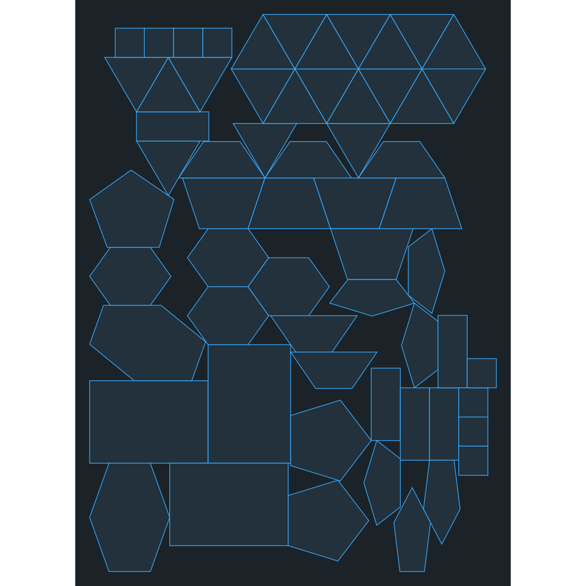

# Irregular Nesting Research And Recovery Brief

Repository: <https://github.com/jfet97/min-plane-dfx>

This document is a self-contained technical handoff and an execution brief for
an expert reviewer. The current convex-polygon nesting result is not acceptable
for mixed jobs. Do not merely review the existing code or suggest generic
heuristics. Inspect the real implementation, delegate independent source and
literature research, reproduce the failing jobs, run experiments, render the
results, and produce a large evidence-backed report with concrete implementation
paths.

This is the living project ledger. External reviewers should treat it as
read-only while reviewing and produce a separate report; implementation owners
must update it when an experiment or production decision changes verified truth.

## Current Work: Priority And Acceptance Gates

The project has one accepted deterministic baseline and several open problems.
Do not trade one open problem for a regression in the accepted baseline. Work in
the following order.

### Primary Problems

1. **Replace the compatibility handoff with genuinely sheet-invariant search.**
   The flagship mixed-61 output is currently unified across ten legal sheets by
   an explicit protected canonical-reference decode and a sheet-free topology
   certificate. That mechanism caches one historical sheet-relative trajectory;
   it does not make ordinary requested-sheet search invariant. The active
   replacement work removes sheet-derived preferences from every branch-removing
   layer and uses real sheet dimensions only for legality. Sheet-relative
   ranking remains intentional only for explicit `short_side_fill`.
2. **Preserve the 20-triangle golden.** The pointed-triangle lattice is a hard
   regression gate, not a special-case production heuristic. A candidate fails
   if it turns the lattice into a chain, fragments structural contacts, creates
   visible triangle-sized holes, or regresses the official repair-8 result. Keep
   the repair-0 search diagnostic separate; it is not the approved golden.
3. **Use the approved mixed-61 layout as a quality witness, not an equality
   gate.** The portable reference
   `help/artifacts/approved-mixed61-ac75222-2000x2700.svg` proves that the job can
   reach `430,344.918 mm2`, two holes, and contacts `53/14`. A general replacement
   may select a different canonical hash if it is exactly legal, invariant across
   every roomy sheet, at least as compact and cohesive, and clears the wider
   corpus gates.
4. **Choose the right source of search diversity.** The current investigation
   compares deterministic candidate diversity with the existing GA. GA may be
   useful for global piece order and rotation, but it cannot repair a promising
   placement branch already discarded by sheet-normalized local pruning. The
   deterministic decoder must first expose and retain intrinsically compact
   legal alternatives; bounded GA can then be evaluated as an optional second
   stage.
5. **Resolve the mixed-50 regression independently.** Terminal orientation and
   scattered mixed-50 behavior must be reproduced headlessly and fixed without
   changing the accepted triangle or mixed-61 checkpoints.

### Secondary Problems

1. **Fill real internal cavities with small pieces.** Small rectangles currently
   enter the reorder window late and may form an external island. A valid fix
   must identify actual bounded fillable space or preserve a suitable small-piece
   candidate; AABB neutrality and raw-contact thresholds are not cavity tests.
2. **Reduce trace size.** Decision traces must retain enough evidence to explain
   pruning while avoiding repeated full state payloads. Replay and search output
   must remain byte-for-byte equivalent in canonical geometry.
3. **Improve runtime without changing semantics.** The main cost is candidate
   generation and scoring, not trace serialization. Profile first, preserve the
   differential oracle, and accept only low-risk measured improvements until the
   ranking behavior is stable.
4. **Avoid dependence on local repair.** Local repair is too expensive for large
   jobs and should remain optional. The main deterministic search should produce
   an acceptable layout without requiring terminal remove-and-reinsert recovery.
5. **Simplify the UI only after one general policy is proven.** Do not remove the
   policy selector or present a universal comparator until the golden and corpus
   gates demonstrate that it is genuinely general.

### Mandatory Gates For Every Ranking Change

- exact official 20-triangle repair-8 golden, rotations and mirroring enabled;
- repair-0 triangle diagnostic no worse than the current baseline;
- exact mixed-61 request on the accepted ten-sheet matrix, requiring one
  canonical hash wherever the common motif is legal and comparison against the
  approved reference's independent quality floors;
- mixed-50, homogeneous rectangles, trapezoids, pentagons, and stars;
- legality, deterministic geometry hashes, and replay/search equivalence;
- rendered SVG/PNG inspection, not metrics alone;
- isolated worktree, immutable manifest, exact commit/diff provenance, and a
  commit before the next experimental variant changes the code.

### Current Production Truth

The official repair-8 triangle golden remains exact. The boundary-anchor,
max-side-first intrinsic, and protected Pareto lanes remain isolated from
production retention and preserve their previously accepted corpus gains.

The mixed-61 hollow-ring output is currently hidden through cross-decode
coordination, not solved in the default decoder.
Eligible explicit compact-quality jobs run the unchanged requested-sheet decode
plus one protected decode on the fixed `2000 x 2700` reference sheet. The
protected terminal is admitted on the real requested sheet only after exact
q0/q90 fit, zero positive overlap, complete finite score decoding, and a
sheet-free topology certificate. The certificate limits exact occupied-union
cavities to two, hull-gap ratio to `0.15`, envelope aspect to `1.5`, isolated
pieces to two, and requires at least half the pieces in the largest positive-
contact component. It deliberately does not let requested-sheet remnant or
normalized-consumption scores veto the same legal collision geometry.

At candidate `5186255`, ten legal sheets from `900 x 1800` through
`2000 x 2700` all select the exact approved motif: canonical hash
`40f8ac9c0fb24073ac141b5fb667366af55df90c78c6cca21ff76703a4a7f300`,
area `430,344.918 mm2`, two holes, and structural contacts `53/14`. The
previous claim that reference reproduction and sheet independence were
mutually exclusive was correct only for independent per-sheet decodes. Guided
legality probes identified the missing architectural stage; the bounded
cross-decode handoff supplies it without changing production beam ranking.

Treat this as a compatibility fallback while the intrinsic replacement is
measured. Its exact historic hash is no longer a mandatory equality gate for a
general replacement; its area, hole, contact, legality, and topology are the
quality witness the replacement must meet or improve.

The capability is schema-owned, defaults off, and is enabled by the explicit
compact-quality settings factory and flagship fixture. Repair, GA transform
preferences, homogeneous jobs, small jobs, and `short_side_fill` remain outside
this expensive path. See
[the final handoff report](research/canonical-reference-decode-handoff.md) and
[portable ten-sheet artifacts](artifacts/canonical-reference-decode-handoff/).

The near-parallel NFP crossing crash is resolved in production by merged pull
request #1. The guarded fallback recovers only strict internal crossings and the
pre-merge differential corpus remained byte-identical.

### Production Rejection Is Not Research Rejection

Treat production readiness and research value as separate decisions. A triangle
golden failure means that a candidate is **unsafe to ship unchanged**; it does
not prove that the algorithmic mechanism is useless. Preserve an isolated
branch, exact commit, metrics, and rendered artifacts whenever a rejected
candidate exposes a coherent layout, improves sheet invariance, reduces real
holes, or reveals a useful ranking or decoding mechanism.

Candidate L and L2 are the concrete example. Neither standalone scorer may
replace the production default because both widen the accepted triangle lattice.
Their hole-free lattice and sheet-intrinsic ranking are still valid research
inputs. Re-evaluate those ingredients together with whole-beam topology
diversity, a different decoder, bounded order/rotation search, or a final search
stage that protects or reconstructs the narrower triangle lattice. Future work
must be allowed to challenge the current comparator and beam architecture; the
triangle golden remains a shipping gate for the combined result, not a rule that
automatically discards every intermediate branch that misses it.

### Current Research Status

- `contact-tier-intrinsic-reservation` M1b/M2: rejected unchanged, but retained
  as evidence for max-side-first intrinsic growth, protected alternatives,
  trace visibility, and independent runtime profiling;
- `protected-contact-tier-reservation`: rejected because the narrow local port
  regresses trapezoids and mixed-50 and does not improve mixed-61;
- `protected-boundary-anchor-diversity`: accepted for repair-disabled production
  after exact output gates and terminal Pareto protection;
- `protected-intrinsic-contact-seed`: accepted for repair-disabled production;
  it preserves production fanout and the boundary lane while improving the
  `2000 x 1700` mixed-61 envelope by `18.99%` and holes from 6 to 4;
- `canonical-reference-decode-handoff`: accepted for explicit compact-quality
  jobs; all ten mixed-61 sheets return the approved `430,344.918 mm2`, two-hole,
  `53/14` motif with one canonical hash;
- Candidate L and M1b sheet invariance: still research-only; neither is a safe
  global production comparator;
- runtime: the protected reference handoff takes `70.4-89.3 s` on the nine
  non-reference sheets in the final ten-sheet gate and `40.1 s` on the reused
  reference decode. The renderer timeout floor is `120 s`; shared-prefix or
  cached decode work is now the main optimization target;
- sheet invariance: closed for the flagship mixed-61 request across ten legal
  sheet dimensions. A universal single-sheet intrinsic decoder remains a
  separate research objective, not a blocker for this accepted result.

Every completed experiment must be recorded below as accepted or rejected. An
uncommitted temporary script or a visually attractive image is not production
evidence.

### Open-Source Control Conclusion

The source-level review is preserved in
[`help/research/open-source-nesting-strategies.md`](research/open-source-nesting-strategies.md).
Deepnest and SVGnest use GA to vary order and rotation around an absolute-envelope
constructive decoder; GA does not make a sheet-normalized decoder independent of
sheet dimensions. PackingSolver supplies the clearest precedent for a bounded
large-first then small-fill phase. The recommended sequence is therefore:

1. make all branch-pruning compactness decisions intrinsic;
2. preserve bounded deterministic order and orientation diversity;
3. evaluate the existing GA as an optional order/rotation portfolio while always
   retaining the deterministic baseline.

## Experiment Provenance Ledger

Do not present a generated layout as reproducible unless this ledger records the
source commit, uncommitted diff or injected comparator, exact request, settings,
metrics, and artifact hashes. Future experiments must write an immutable manifest
in their isolated worktree before production code is changed. Promote accepted
artifacts into `help/artifacts/` and durable research reports into `help/research/`.

### Protected Intrinsic Contact Seed

```text
experiment:           protected-intrinsic-contact-seed
production base:      20d74f6379c4865ec9654d351b3bcbae7b2aae81
algorithm checkpoint: 13a23510df57365e1242323b30f5463b06b62e61
harness checkpoint:   221da872a085be66da0913ab6a16727b7d842f8e
local seed:            one positive exact-contact-tier max-side winner
production fanout:     unchanged
protected widths:      legacy boundary 8, intrinsic contact 1
terminal acceptance:   strict production comparator plus smaller area
changed sheet:         2000 x 1700
baseline area / holes: 661,441.643 mm2 / 6
candidate area / holes: 535,808.686 mm2 / 4
candidate hash:        236f5f40e722bce2ba2dacecdc18ec4c1ce01344f944a2fce1c49bfbe19f7159
four-sheet hashes:     4 (invariance not closed)
```

The other three mixed-61 sheets and every existing two-sheet corpus output are
exact current-main hashes. The intrinsic lane uses contact strength, direct
maximum side, area, span, raw hull waste, placement identity, and
translation-normalized geometry only; sheet-normalized, boundary-coordinate,
and free-material fields are excluded from protected pruning.

Portable evidence:

- [research report](research/protected-intrinsic-contact-seed.md);
- [changed SVG](artifacts/protected-intrinsic-contact-seed/mixed-61-2000x1700.svg);
- [Chromium PNG](artifacts/protected-intrinsic-contact-seed/mixed-61-2000x1700.png);
- [manifest](artifacts/protected-intrinsic-contact-seed/manifest.json).

### Approved Mixed-61 Reference: `depth21-total2`

This is the compact reference image the user explicitly approved. It must not be
confused with later scale-diversity experiments or with current UI output.

```text
experiment:          depth21-total2
repository base:     ac75222
experimental source: historical comparator sweep captured by the manifest below
production ancestor: 381cd2f
saved request job:    780d4ec5-b64e-4f48-a8d8-0bfd30877549
sheet:                2000 x 2700 mm
reorder / beam:       4 / 8
local fanout:         4
local repair:         disabled, budget 0
transform cap:        8
minimum edge:         1.2 mm
angle dedupe:         0.051 degrees
local policy:         edge contact, then compactness
GA:                   disabled
rotations / mirroring: enabled / enabled
padding:              10 mm
bounds:               564.660 x 773.545 mm
bounds area:          436,789.920 mm2
bounds span:          1,338.205 mm
occupied hull waste:  0.246346
total / dominant structural contacts: 56 / 14
normalized contact units: 58.907038
free-material holes:  2
history-off runtime:  20.16-20.98 s
```

Portable repository artifacts and SHA-256 hashes:

```text
help/artifacts/approved-mixed61-ac75222-2000x2700.svg
c7b2fa24a5fa721fa9ff87c7aafff3e25ff0d89474be7be7191117fe05c64a34

help/artifacts/approved-mixed61-ac75222-2000x2700.png
69599fb77b587aaf7f7930fa20ae04eeb8365ff02d2839501a715e0a5c5b6b93

help/artifacts/approved-mixed61-ac75222-2000x2700.manifest.json
f618afe31f512d05753d925ff1dc2a6be3e9590fc66ea0ff7131b1f353fbcf76
```

Exact approved layout:



The key sheet/code comparisons are also tracked with this document:

- [same `ac75222` search on the `1000 x 1700` sheet](artifacts/ac75222-1000x1700-sheet-dependent-failure.svg);
- [`b164d61` scale-diverse search on `2000 x 2700`](artifacts/b164d61-2000x2700-scale-diverse.svg);
- [`b164d61` scale-diverse search on `1000 x 1700`](artifacts/b164d61-1000x1700-scale-diverse.svg).

See [the artifact manifest](artifacts/README.md) for source commits, requests,
expected bounds, and hashes.

The repository PNG matches the user-approved reference byte-for-byte. A legacy
SVG with the same experiment name was overwritten by a later experiment while
its PNG was not; that legacy pair has mixed provenance and must never be used as
a reproducibility source.

Commit `b164d61` later added an extra positive-contact balanced candidate and a
post-20 compactness survivor. Those mechanisms changed the search path. The
production restoration recorded below removes those two escape paths, restores
the earlier terminal corner selection, and ports the exact `depth21-total2`
post-20 comparator. The 25% and 50% raw-contact-floor variants were rejected:
both elongated the triangle golden to a `529.728 mm` long side.

The restored production code reproduces the approved request exactly:

```text
canonical geometry SHA-256: 9806dcd9119f6276df51ee92ca0389b18461fc586aa6ae2bcda88c313a727142
bounds:                    564.660 x 773.545 mm
bounds area:               436,789.920 mm2
structural contacts:       56 total / 14 dominant
normalized contact units:  58.907038
```

The verification artifact is
[`help/artifacts/approved-mixed61-ac75222-2000x2700.svg`](artifacts/approved-mixed61-ac75222-2000x2700.svg).
Sheet-independent compactness is deliberately a separate follow-up; it must not
be mixed into this known-good checkpoint.

### Sheet-Independent Compactness Investigation

The sheet controls legality, but balanced compactness and edge-contact fallback
ranking must not change merely because the same legal pieces are placed on a
larger sheet or on a sheet with a different aspect ratio. Normalized sheet
consumption remains diagnostic and remains relevant only to the explicit
short-side-fill policy.

Rejected isolated variants from branch `aspect-independent-compactness`:

| Intrinsic order | Triangle-golden outcome | Status |
| --- | --- | --- |
| area, then span | long side `924.646 mm` | rejected |
| longest axis, then total span, then area | short side `240.224 mm` | rejected |

An isolated six-order sweep then changed only the whole-layout comparator while
leaving local candidate ranking untouched. Every intrinsic whole-layout order
preserved the triangle golden (`353.152 x 227.025 mm`, 24 structural contacts,
17 dominant contacts, zero holes), but none made mixed-61 sheet-invariant. The
best diagnostic order, longest side then area then span then hull waste, produced
`536.614 x 870.644 mm` on `2000 x 2700` and `613.455 x 691.682 mm` on
`1000 x 1700`, with different canonical geometry hashes.

The failure is simple: local placement ranking still uses sheet-normalized
compactness. The two sheets therefore choose different placements early, and a
sheet-independent final comparator cannot recover a branch that local fanout or
beam pruning already discarded. Naively replacing the local tuple with simple
intrinsic area/span/axis orders breaks the triangle golden. The next experiment
must remove sheet dependence from local tie-breaks while preserving structural
contact behavior; none of the six whole-layout-only variants was merged.

The rejected sweep conclusions are preserved in this section. Its ephemeral
working files are intentionally not part of the portable handoff.

Four fresh production UI runs isolate the same failure with stronger evidence.
They use the same 61 pieces, edge-contact local policy, reorder window 4, beam
width 8, fanout 4, transform cap 8, and repair disabled. Only the sheet size
changes:

| Sheet | Decision-trace job | Envelope area | Envelope span | Structural contacts | Holes | Result |
| --- | --- | ---: | ---: | ---: | ---: | --- |
| `2000 x 2700` | `1af21a70-18a0-4ea0-a46f-3c617dbf97f2` | `436,789.920 mm2` | `1,338.205 mm` | `56` | `2` | approved |
| `2000 x 1700` | `e86dddae-825a-43aa-a813-a1baafca949a` | `642,863.780 mm2` | `1,612.863 mm` | `58` | `6` | rejected |
| `1000 x 1700` | `7612edf3-541b-4ddd-82f8-d57e5d9c82a4` | `713,249.355 mm2` | `1,898.661 mm` | `57` | `0` | rejected strip |
| `1000 x 1300` | `ff60c5be-2eab-42e9-86f8-8e9e13c5b1e2` | `701,017.819 mm2` | `1,717.904 mm` | `60` | `1` | rejected |

Only `2000 x 2700` reproduces the approved compact result. The rejected runs
can have more structural contacts while consuming 47-63% more envelope area.
This does not by itself identify the first bad local decision, but it proves
that contact count cannot compensate for the sheet-normalized local ranking
selecting a worse intrinsic motif. These four sheet sizes are mandatory gates
for the isolated local-ranking fix; no further manual UI runs are required.

Candidate J on isolated branch `dual-policy-sheet-invariance` combined two local
survivors with an intrinsic global tuple. It passed all 64 focused triangle,
windowed-beam, and layout-scorer tests, including the exact triangle golden, but
failed the first mixed-61 sheet gate:

| Sheet | Envelope | Area | Structural contacts | Holes |
| --- | --- | ---: | ---: | ---: |
| `2000 x 2700` | `662.870 x 670.565 mm` | `444,497.578 mm2` | `54` | `0` |
| `1000 x 1700` | `825.162 x 859.396 mm` | `709,140.553 mm2` | `56` | `3` |

The canonical geometry hashes differ. Candidate J is therefore rejected as a
production change even though its reference-sheet result is close to the
approved checkpoint. The divergence audit found the first true split at step 2;
the terminal audit then separated a numerical tie defect from the actual search
failure. At step 2, translated-equivalent states differed only by about
`1e-16` in the raw `occupiedHullWasteRatio` because convex-hull shoelace
arithmetic used absolute coordinates. Canonicalizing that diagnostic moves the
first semantic divergence to step 3.

At step 3, both sheets generate the same legal bottom candidate from the same
parent: `114.504 mm` shared contact, transform `0`, and point `(164.504, 0)`.
It ranks sixth and survives on `2000 x 2700`, but ranks tenth and is pruned on
`1000 x 1700`. Only the sheet-normalized local compactness fields change its
rank. Candidate generation and legality are therefore not the cause; local
fanout ranking is. Candidate J's two global reservations also collapse onto
already higher-contact winners, so the next diversity experiment must preserve
alternatives inside contact tiers instead of merely reserving another global
winner.

The numerical part is fixed in production at `95de72c`: the dimensionless
occupied-hull waste ratio is canonicalized on the existing `0.000001` scalar
score grid before ranking. A translated-equivalence regression now compares
identical layouts exactly, and the 20-triangle golden remains green. This moves
the Candidate J divergence from the false step-2 tie to the real step-3 local
ranking split; it deliberately does not claim sheet invariance.

Candidate K on isolated commit `b14af3c` added four geometry-deduplicated local
reservations within the existing fanout: original edge-contact, original
balanced compactness, intrinsic edge-contact, and intrinsic compactness. This
failed before the mixed corpus ran: the triangle golden's short side grew to
`302.700 mm`, above the accepted `228 mm` limit. The explicit four-slot local
portfolio is rejected and the deterministic portfolio probe does not duplicate
it.

Candidate L tested whether the edge-contact local scorer itself could become
intrinsic without adding fanout reservations. Isolated commit `1fbf314` ranked
near-complete structural contacts and whole contact-unit bands before intrinsic
maximum side, area, and span. Isolated follow-up `c66af81` simplified that tuple
to raw shared-contact length followed by the same intrinsic compactness fields.
Both variants passed all 15 focused placement-scorer tests but failed the
20-triangle golden identically: the final long side grew to `397.296 mm`, above
the accepted `354 mm` limit. Their rendered geometry is nevertheless coherent:
both produce the same hole-free three-row triangular lattice, with
`397.296 x 227.025 mm` collision bounds, zero occupied-hull waste, and no
free-material holes. The result is wider than the accepted lattice, but it is
not a chaotic chain or a failed packing mechanism.

Candidate L and L2 are therefore rejected **for direct production use in their
current standalone form**. This rules out replacing the local edge-contact
tuple with either simple intrinsic order and shipping it unchanged. It does not
justify stopping their corpus evaluation, deleting their branches, or treating
their intrinsic-ranking ingredients as useless. The exact commits and rendered
results remain research inputs for combinations in which contact-tier beam
diversity, a different decoder, order/rotation search, or a later global search
protects or rebuilds the more compact triangle lattice.

### Interpreting Failed Golden Gates

A triangle-golden failure means **not safe to ship as-is**, not **the
algorithmic idea is useless**. It is a shipping gate, not a permanent research
veto. In particular, Candidate L/L2 remain valid research branches: their
sheet-intrinsic ranking ingredients may still be useful when combined with
whole-beam diversity, order/rotation search, or a decoder that protects or
rebuilds the compact triangle lattice.

Every experiment must be classified in two separate ways:

1. **Production readiness:** a candidate that breaks legality, the accepted
   triangle lattice, or a protected mixed-job checkpoint must not be merged as
   the current default.
2. **Research value:** preserve the exact branch/commit, metrics, and rendered
   geometry when the candidate exposes a useful mechanism or improves other
   fixtures. Later experiments may recombine that mechanism with diversity,
   order/rotation search, repair-free decoding, or a different final selector.

Use the following decision table instead of treating the golden as a binary
judgment on an entire algorithm family:

| Experimental result | Production decision | Research decision |
| --- | --- | --- |
| Illegal geometry, missing pieces, or nondeterministic replay | Reject unchanged | Retain only if it isolates a geometry or determinism defect |
| Legal result that fails the triangle quality envelope | Do not ship unchanged | Retain the exact branch when it improves another protected fixture or exposes a useful mechanism |
| Passes the triangle golden but regresses mixed or sheet-invariance gates | Do not ship unchanged | Keep as a bounded ingredient and identify the conflicting objective |
| Passes the triangle golden and the relevant mixed, topology, legality, and invariance gates | Eligible for production review | Preserve the provenance and corpus evidence |

The triangle golden is therefore not the optimizer and it is not proof that the
current beam architecture is correct. It protects one known high-quality motif
from silent regression. A research branch may temporarily lose that motif while
demonstrating a better intrinsic ranker, decoder, topology survivor, or search
schedule. The useful part should then be recombined with a mechanism that
recovers the lattice before the combined candidate is proposed for production.
Do not force every exploratory scorer to imitate the current triangle trace, and
do not discard improvements that could become compatible after later beam or
decoder changes.

Do not discard an algorithm family solely because its first standalone version
fails the triangle golden. Conversely, do not weaken the golden just to accept a
promising mixed-job screenshot. Keep both facts visible, test combinations on a
broader corpus, and require a production candidate to recover acceptable compact
triangles before it becomes the default. External reviewers should explicitly
challenge current thresholds, comparator assumptions, and beam architecture;
the documented goldens are protected evidence, not proof that the present
algorithm is optimal.

In practical terms, a failed protected gate changes the decision from “ship” to
“continue in an isolated research branch”; it does not change the decision to
“discard”. For L/L2 specifically, the remaining questions are whether their
sheet-intrinsic local ordering improves mixed-50, mixed-61, homogeneous, or
sheet-invariance fixtures, and whether a small diversity or decoder change can
recover the narrower triangle motif without reintroducing sheet-normalized
pruning. Record both successes and regressions. A later combined candidate may
legitimately use L/L2 ingredients even though neither original commit is safe as
the production default.

For Candidate L, the retained ingredient is the combination of structural
contact bands and sheet-intrinsic envelope ordering: its large mixed61
sheet-stability improvement is evidence that this direction addresses a real
defect, even though its standalone triangle lattice is too wide. Candidate L2
is weaker evidence, but its raw-contact-first result helps delimit which part of
L matters. Future work should test those ingredients behind whole-beam topology
diversity, a protected lattice/contact lane, or a different decoder. A failure of
the original L/L2 commits must not be cited as evidence that every such
combination will fail.

The completed corpus audit validates that distinction. Candidate L reduces the
mixed61 four-sheet envelope-area spread from `276,459.435 mm2` to
`50,457.263 mm2` (`81.75%`), improves the three non-reference sheets by
`18.57-24.86%`, and makes the homogeneous rectangle fixture exactly
sheet-invariant. It still regresses the approved `2000 x 2700` mixed61 envelope
by `19.84%`, so it cannot ship unchanged. Candidate L2 loses most of that
stability and is the weaker lead. Preserve L's structural-contact bands plus
intrinsic envelope ordering for recombination with a protected contact lane;
do not promote its standalone scorer. Full metrics, hashes, and portable
previews are in
[`research/candidate-l-corpus-audit.md`](research/candidate-l-corpus-audit.md).

The contact-tier diversity follow-up also completed. M1 preserves the triangle
golden and keeps three mixed61 sheets within `435,290-485,539 mm2`, but the
`2000 x 1700` result remains a `642,864 mm2` perimeter-like layout. M2 reserves
an intrinsic winner in every represented contact tier; it increases contact and
reduces holes while worsening the reference envelope to `830,381 mm2`. Neither
is production-safe. The useful M1 mechanism remains a research ingredient, but
the next experiment must preserve different whole-beam topologies rather than
add broader local contact-tier reservations. Full evidence is in
[`research/contact-tier-diversity-experiment.md`](research/contact-tier-diversity-experiment.md).

The bounded order/rotation GA probe is also complete. It retained the
deterministic baseline and improved homogeneous rectangles, but cost `4.3-6.4x`
more, remained sheet-dependent, and selected a mixed-61 reference-sheet result
with `513,154 mm2` envelope area instead of the retained `436,790 mm2` baseline
while increasing holes from 2 to 5. Keep the harness for later combinations;
do not merge the current GA as the default. Full evidence and portable visuals
are in
[`research/bounded-ga-order-rotation-probe.md`](research/bounded-ga-order-rotation-probe.md).

The deterministic multi-order portfolio probe is likewise rejected only as a
standalone production change. Small-filler interleaving, shape-family
round-robin, and orientation-family distribution still produced four different
triangle geometries across the sheet matrix; the 1000 x 1700 result was a
`151.350 x 529.728 mm` strip. The current local pruning had already removed the
needed branch before final portfolio selection. The exact experiment remains
available for later combinations in
[`research/deterministic-portfolio-probe.md`](research/deterministic-portfolio-probe.md).

## Required Research Behavior

Treat the task as an algorithm and systems investigation, not as a small bug fix.

1. Read this repository's `AGENTS.md`, `SCORING_CRITERIA_NOTES.md`, `plan.md`,
   `docs/architecture.md`, and `docs/architecture/index.md` before proposing
   changes.
2. Read the current worker implementation, especially the files listed in
   [Source Map](#source-map).
3. Delegate independent bounded investigations when possible:
   - one worker for the two newest mixed-job traces;
   - one worker for DeepNest and SVGnest source;
   - one worker for libnest2d, Sparrow, PackingSolver, and additional projects;
   - one worker for literature, optimization methods, and data structures;
   - one worker for headless corpus generation and visual comparison.
4. Inspect actual source code. README-level comparisons are insufficient.
5. Search the web for current irregular nesting algorithms, implementations,
   papers, benchmarks, and production lessons. Prefer papers and upstream source
   over summaries.
6. Separate facts from inference. Every upstream claim should cite an exact
   repository, commit or release, file, symbol, and line range when practical.
7. Reproduce the real fixtures headlessly. The user should not need to launch the
   Electron UI to validate an algorithm experiment.
8. Render SVG outputs to complete PNG previews and inspect the images. Metrics
   alone are not an acceptance test for visible fragmentation.
9. Challenge the current assumptions. A modest regression on a specialist corpus
   case may be acceptable if a general strategy eliminates catastrophic mixed-job
   layouts while preserving legality and the triangle golden.
10. Do not overfit one screenshot, one shape class, one piece count, or one magic
    threshold. Test repeated and mixed jobs from roughly 10 to 100 pieces.
11. Produce a substantial final research document containing evidence, failed
    ideas, promising paths, estimated complexity, risks, and an ordered
    implementation plan.

## Immediate Objective

Fix convex irregular nesting so that mixed jobs form a compact, coherent
occupied cluster instead of several shape-specific islands, long chains, or a
tall fragmented column.

The current unacceptable 61-piece result visibly exhibits:

- a triangle lattice separated from the rest of the job;
- a small-rectangle island beside the triangles;
- trapezoid, hexagon, star, and large-rectangle groups separated by obvious
  reusable material gaps;
- excessive vertical envelope consumption;
- several local contact-rich motifs that do not combine into a compact global
  layout;
- large empty regions inside the occupied bounding envelope.

This is not a rendering problem. The worker is returning a legal but poor
layout. The search and objective are rewarding local contact structure more
strongly than global consolidation.

## Current Repository State

`main` and `origin/main` contain documentation and diagnostic additions after
`ef1fbe2`, but production search behavior still comes from `ef1fbe2`, the first
checkpoint that reproduces the explicitly approved mixed-61 layout exactly.
Later accepted commits add the sheet-invariance diagnostic corpus, experiment
provenance rules, and portable help artifacts without changing placement,
scoring, or search.

The accepted checkpoint chain is:

- `968f164`: record immutable nesting-experiment provenance;
- `32c1951`: move this handoff into `help/` and add portable reference SVGs;
- `ef1fbe2`: restore the approved `ac75222` beam-search semantics and port the
  exact `depth21-total2` post-20 comparator into production;
- `ff5e266`: add the seven-fixture sheet-invariance corpus, exact layout
  canonicalization, and the persisted mixed-61 request.

`ef1fbe2` deliberately removes the later scale-diverse escape paths that changed
the search trajectory: the extra positive-contact balanced local candidate and
the post-20 compactness beam survivor. It also restores terminal corner-gap
selection and uses strict dominant contacts plus two-total-contact bands after
placement depth 20 before intrinsic compactness.

The checkpoint passed `64/64` focused scorer, beam, schema, renderer, and
20-triangle golden tests. Lint, typecheck, the worker build, and diff validation
also passed. The rebuilt worker reproduces the saved mixed-61 request with:

```text
canonical geometry SHA-256: 9806dcd9119f6276df51ee92ca0389b18461fc586aa6ae2bcda88c313a727142
bounds:                    564.660 x 773.545 mm
bounds area:               436,789.920 mm2
structural contacts:       56 total / 14 dominant
normalized contact units:  58.907038
free-material holes:       2
```

This is a protected known-good checkpoint, not the end state. The remaining
work is isolated into separate changes:

1. make balanced and edge-contact compactness independent of sheet dimensions
   while preserving the triangle lattice and the approved mixed-61 geometry;
2. retain the restored terminal corner behavior with an explicit mixed-50
   regression test;
3. use a deterministic multi-shape corpus to reject layouts that improve a
   scalar envelope metric while worsening holes, connectivity, or repeated-shape
   structure;
4. reduce trace volume and runtime only after search semantics are protected by
   those gates.
5. investigate bounded access to small filler pieces so rectangles that legally
   fit existing internal cavities are not stranded in a separate island.

## Product And Architecture

`min-plane-dfx` is a local Electron application for importing DXF parts,
preparing nesting jobs, running a worker-owned optimizer, replaying history, and
exporting transformed source geometry.

Main process responsibilities:

- filesystem and dialog access;
- SQLite temporary workspace;
- portable project JSON import/export;
- worker lifecycle and timeout supervision;
- persisted run records and NDJSON history files.

Renderer responsibilities:

- dense CAD-like settings UI;
- imported-part and run state through composables;
- real worker result and history visualization;
- no invented placement or score data.

Worker responsibilities:

- piece ordering;
- geometry preparation and transformed collision artifacts;
- rectangular or irregular candidate generation;
- legality checks;
- local placement ranking;
- beam/portfolio search;
- whole-layout scoring;
- terminal repair and orientation selection;
- history and decision-trace emission;
- final validation and protocol output.

Search, placement, and scoring behavior belongs in
`src/workers/algorithm/`. Deterministic geometry kernels and their Effect service
boundaries belong in `src/workers/irregular/` and must not invent scores or
placements.

## The Rectangular Engine

The established engine treats every prepared piece as an axis-aligned or rotated
rectangle. It is based on MaxRects-style free rectangles and a bounded beam.

Important properties:

- the padded rectangular footprint is the legality model;
- the piece order is deterministic and starts with long, large, imbalanced
  pieces;
- candidate strategies place real rectangles into real free rectangles;
- the beam retains several partial layouts;
- score-cross strategies compare global compactness and local free-rectangle
  quality;
- history contains real states emitted by the worker.

The rectangular engine is robust but wastes material for triangles, trapezoids,
angled parts, circles, and other shapes whose convex area is much smaller than
their bounding box.

Do not copy rectangular free-rectangle assumptions into polygon legality. Its
ordering, compactness criteria, and beam-diversity lessons remain relevant.

## The Convex-Polygon Engine

The irregular engine uses conservative convex collision polygons:

```text
DXF source geometry
  -> nesting-grade curve flattening
  -> convex hull
  -> outward padding offset
  -> finite rotation/mirror transforms
  -> rectangular-sheet IFP bounds
  -> pairwise convex NFP boundaries
  -> legal contact candidates
  -> direct robust-predicate validation
  -> local candidate scoring and fanout
  -> windowed beam retention
  -> optional GA portfolio
  -> optional terminal remove/reinsert repair
  -> terminal quarter-turn selection
  -> bottom-left-normalized result and replay
```

The source DXF remains authoritative for display and export. The padded convex
collision polygon is authoritative for nesting clearance and overlap.

### Padding Geometry

Total cutting padding is divided between neighboring parts. The collision offset
distance is:

```text
padding / 2 + clearanceSafetyMarginMm
```

The live offset policy uses Clipper2 `Paths64`, a `0.001 mm` grid, Miter joins,
and a finite miter limit of `10.0`. This was raised from `2.0` so the repeated
triangle fixture keeps pointed acute corners instead of acquiring short chamfer
edges that create misleading contact candidates.

Every experimental layout must preserve:

- direct collision legality;
- sheet containment;
- requested padding and safety margin;
- deterministic grid output;
- final validation against all placed collision polygons.

### Transform Generation

Each piece receives a deterministic finite transform family:

- orthogonal quarter turns when rotation is enabled;
- explicitly configured rotations;
- usable edge-derived orientations;
- optional mirrored versions when both global and per-piece mirroring allow it;
- exact periodic angle deduplication;
- a configured transform cap.

Equivalent translated collision rings are deduplicated before local fanout so
copy IDs or redundant transform descriptions do not consume survivor slots.

### Candidate Generation

For one transformed moving polygon:

1. Compute rectangular-sheet IFP placement bounds.
2. Compute NFP boundaries against placed collision polygons.
3. Add IFP corners, NFP vertices, relevant NFP/IFP intersections, pairwise NFP
   intersections, and antiparallel edge-support points.
4. Canonicalize and sort candidate points.
5. Reject points inside forbidden NFP interiors.
6. Run direct placement validation against the sheet and placed polygons.

NFP/IFP generation proposes placements. Direct validation is the legality
authority.

### Piece Ordering

`src/workers/algorithm/sortPiecesForNesting.ts` sorts padded bounds by:

1. longest edge descending;
2. area descending;
3. imbalance descending.

This is a user-owned algorithm boundary. Change it only as an explicit algorithm
experiment with evidence. The current mixed result appears grouped by similar
size/shape families, so ordering and deferral behavior must be investigated even
if the whole-layout scorer is the primary suspect.

The latest accepted mixed layout exposes a narrower follow-up: several small
rectangles remain in an external island even though visible cavities between
larger polygons appear large enough to contain them. This suggests that the
fixed initial order plus `orderWindow = 4` may make useful small fillers
unavailable when those cavities are created. Do not solve this by globally
sorting small pieces first. After the approved comparator and sheet-invariance
gates are integrated, test bounded filler access independently through one or
more of:

- a deterministic cavity-fit candidate within the existing reorder window;
- bounded deferral or a reserved small-filler successor when a legal internal
  cavity placement exists;
- explicit cavity-utilization diagnostics that distinguish a reusable hole from
  harmless hull waste;
- a local remove-and-reinsert experiment that is cheaper and more targeted than
  the existing terminal repair.

The experiment must preserve the triangle golden, legality, deterministic
copy-ID deduplication, and the exact approved mixed-61 checkpoint before any
production change is accepted.

Trace evidence now isolates the access problem more precisely. In the exact
mixed-61 request, the eight padded `40 x 40 mm` squares occupy priority slots
54-61 and first become eligible only at beam step 50. Candidate generation is
healthy once they are eligible: the first square produced 326 raw candidates,
47 unique legal geometries, four locally selected candidates, and multiple
successors that survived whole-beam selection. The missing fillers are therefore
not primarily an NFP, fanout, or copy-deduplication failure; they become
available after earlier pieces have already determined the cavity topology.

Two isolated early-access probes were rejected even though their triangle and
windowed-beam tests passed:

- reserving a deferred small filler only when its placement did not enlarge the
  occupied AABB created external square blocks and increased the mixed layouts
  to 6-10 free-material holes;
- additionally requiring shared contact of at least 1.5 times the filler longest
  edge still grouped fillers on the perimeter and produced 7-10 holes.

The next filler experiment must identify an actual bounded internal
free-material cavity and prove containment of the filler collision polygon.
AABB neutrality and raw shared-contact thresholds are not valid cavity proxies.

### Windowed Beam

The deterministic decoder keeps a bounded set of partial layouts. At every step
it may choose among a prefix of remaining priority-ordered pieces, generates
transforms and legal contact candidates, retains local fanout, scores successors,
deduplicates equivalent occupied geometry, and keeps `beamWidth` states.

The current compact-quality profile is:

```text
orderWindow = 4
beamWidth = 8
localCandidateFanout = 4
localRepairBudget = 8
transformCap = 8
local policy = edge contact, then balanced compactness
GA = disabled
```

The reorder window has a bounded-deferral rule so a difficult early piece cannot
be bypassed indefinitely.

### Current Local Candidate Policy

The local `edge contact, then balanced compactness` policy rewards exact shared
boundary on padded collision envelopes, followed by compact candidate bounds.
This policy successfully builds repeated motifs but may encourage a shape to
join its nearest compatible family rather than bridge separate groups.

### Short-Side-Fill Pathology

`short-side-fill` is not a global compactness objective and its label is easy to
misread. It does not minimize the shorter side of the occupied cluster. It
identifies the physically shorter sheet axis and ranks local candidates by:

1. **maximizing** normalized fill on that sheet axis;
2. minimizing normalized fill on the sheet's longer axis;
3. only then comparing normalized span, area, absolute span, and bottom-left
   tie-breakers.

On the current `2000 x 2700 mm` sheet, this means maximizing cluster width
before compactness. The fresh 61-piece run at `2026-07-17 10:20:52` built a
roughly `2000 x 226 mm` horizontal chain. Terminal quarter-turn selection then
legally rotated that chain into a roughly `226 x 2000 mm` vertical layout because
the rotated orientation consumes a smaller normalized fraction of the
rectangular sheet. The result had about `452,590 mm2` collision-bounds area,
`0.740741` worst normalized consumption, and `16` free-material holes. The
visible long vertical chain is therefore consistent with the current code even
though it is unacceptable nesting quality.

Do not tune this by swapping one axis sign without a corpus test. The general
fix should remove `short-side-fill` from the user-selected deterministic path or
replace its strict prefix with an envelope-growth guard. If it remains useful at
all, keep it as a bounded portfolio source whose candidates still compete under
the general whole-layout comparator. Test the change on rectangular and square
sheets, both portrait and landscape orientations, before removing its schema or
UI compatibility value.

### Current Whole-Layout Comparator

The whole-layout comparator is depth-aware and lexicographic. At 20 or fewer
placements it retains the strict contact-first order needed by the accepted
triangle lattice. Above 20 placements it uses this current order:

1. fewer unplaced pieces;
2. higher dominant repeated structural-contact count;
3. higher `floor(total near-complete structural contacts / 2)`;
4. lower worst normalized collision-bounds sheet consumption;
5. lower normalized collision-bounds span sum;
6. lower collision-bounds area;
7. lower collision-bounds absolute span;
8. lower occupied convex-hull waste ratio;
9. higher exact total near-complete structural-contact count;
10. higher continuous normalized contact units;
11. higher raw shared padded-boundary length;
12. lower collision-bounds bottom coordinate;
13. lower collision-bounds left coordinate;
14. free-material diagnostics and deterministic identities.

Dominant repeated contact still remains strict, and crossing a two-contact band
still dominates compactness. Those choices require further corpus evidence. The
fixed placement-depth separator is deliberately visible and tested; future work
should replace it with a scale-aware condition if a broader rule performs as
well.

## Accepted Triangle Golden

The hermetic regression fixture creates 20 identical built-in `70 x 60 mm`
triangles on a `2000 x 2700 mm` sheet with `10 mm` total padding, rotations and
mirroring enabled, and the compact-quality profile.

The accepted orientation-invariant envelope is approximately:

```text
placed pieces:                  20 / 20
collision envelope:            353.152 x 227.025 mm
collision-bounds area:         80,174.3328 mm2
collision-bounds span:         580.177 mm
occupied-hull waste ratio:     0.047619
structural contacts:           24
dominant repeated contacts:    17
free-material holes:           0
```

The golden intentionally permits interchangeable-copy permutations and terminal
quarter turns. It rejects tall/rightward chains, missing pieces, weak contact
graphs, and triangle-sized lattice holes.

Test:

```sh
pnpm test:focused tests/unit/irregularTriangleCompactGolden.test.ts
```

The golden is a gate, not a demand that every job optimize contact count before
compactness.

## Current Mixed-Job Failure

The failing real job contains 61 convex pieces from several shape and size
families. Its exact request is persisted in the Electron workspace and has been
used by headless benchmark harnesses.

The unacceptable visible result is a legal but fragmented layout. It is not
enough to report that all pieces fit. Quality must account for:

- collision envelope width, height, area, and normalized consumption;
- occupied-hull waste;
- large visually usable voids between groups;
- contact-graph components and concentration;
- whether identical motifs are consolidated into the same global cluster;
- final material utilization, not only local shared edges.

Exactly two newest morning decision traces must be analyzed for the current
investigation. Record their job IDs, timestamps, settings, winners, and first
decisive pruning events in this file or a linked durable report. Do not mix them
with older experimental traces.

## Strategy Experiments Already Performed

These experiments are evidence, not permanent prohibitions. Revisit them when a
new combination, separator, survivor policy, ordering rule, or outer search
changes the tradeoff.

### Pure Compactness

Ranking compactness without structural contact produced a small but chaotic
triangle cluster with almost no real shared boundary. It avoids chains but loses
the repeated lattice.

### Strict Raw Shared Boundary

Ranking total shared millimeters before compactness retained many contacts but
created sprawling contact graphs. Short offset/chamfer contacts could outrank a
materially tighter cluster.

### Normalized Contact Bands

Pair contact was normalized by the smaller polygon's longest edge and grouped
into integer bands. This prevented tiny contact increments from always beating
compactness but still did not solve mixed jobs broadly.

### Strict Structural Contacts Before Compactness

This was the original `e883e3b` comparator. It preserved the triangle golden
with terminal repair but produced catastrophic mixed-job fragmentation. It is
retained as a benchmark reference, not the current production order above 20
placements.

### Global Two-Contact Band

Banding structural contacts by two significantly improved the mixed 61-piece
fixture and rectangle repetition, but earlier evaluation rejected it because it
changed the triangle golden and regressed some pentagon/mixed corpus metrics.
The user has now explicitly changed the tradeoff: a small percentage regression
on secondary fixtures may be acceptable if catastrophic mixed layouts disappear
and the triangle golden stays strong.

### Depth-Aware Two-Contact Band

One measured variant kept strict comparison through 20 placements and then
banded total structural contacts by two. It preserved the exact 20-triangle
golden and all 20-piece corpus outputs byte-for-byte while improving the earlier
mixed61 envelope area by roughly 17.9%. It was previously rejected because
pentagons50 regressed by roughly 9.1%.

This strategy is now the pushed production checkpoint at `381cd2f`. The
hard-coded depth boundary remains a known compromise that must be explained or
replaced by a scale-aware quantity when possible.

### Three Fresh Local-Policy Runs

Three fresh UI runs used an identical 61-piece workload, beam width 8, transform
cap 8, fanout 4, and repair budget 0. They varied only the local placement
policy:

| Policy | Runtime | Bounds area | Worst normalized | Dominant / total contacts | Holes |
| --- | ---: | ---: | ---: | ---: | ---: |
| edge contact, then compactness | 15.472 s | 436,789.920 mm2 | 0.286498 | 14 / 25 | 2 |
| short-side fill | 16.706 s | 452,590.000 mm2 | 0.740741 | 7 / 21 | 16 |
| balanced compactness | 17.240 s | 416,066.612 mm2 | 0.279177 | 2 / 21 | 18 |

Edge contact is the strongest structural compromise; balanced compactness is
about 5% tighter in bounds area but visibly perforated; short-side fill is the
clear failure. These are policy variants, not same-configuration determinism
runs, and none exercised repair.

The same analysis exposed a score-reconstruction defect: terminal trace events
and `decode_winner` reported inflated contact length, units, and total structural
contacts relative to the persisted final result, although placements, bounds,
free-material metrics, and replay agreed. Commit `ac75222` fixed this boundary by
preserving the selected state's rigid-transform-invariant contact scores during
final reconstruction.

### Contact-Density Band

A count-free density tolerance around structural contacts preserved the golden
and improved mixed61. It was previously rejected after approximately 4.5%
pentagon50 and 0.8% mixed50 regressions plus weaker rectangle contacts. Revisit
whether those regressions are acceptable relative to the real failure, and test
whether density should depend on placed count, graph components, or envelope
growth.

### Fixed Dual-Objective Beam Quotas

Reserving beam slots for strict-contact and relaxed-contact rankings preserved
the triangle golden and improved mixed61 by about 11%, but one measured split
regressed rectangle50 area by about 6.4% and created more holes. Fixed quotas may
be too blunt; Pareto-front or adaptive diversity may work better.

### Current Scale-Diverse Compactness Experiment

The newest useful direction combines two narrowly bounded diversity mechanisms
with the existing contact-aware search. It is still an uncommitted experiment
and must not be confused with the pushed `ac75222` checkpoint.

The exact current-request comparison uses a `1000 x 1700 mm` sheet, 61 pieces,
beam width 8, local fanout 4, transform cap 8, repair disabled, and saved request
job `d347b4b4-8b03-44bf-8a09-bf9c3ac640c8`. The relevant UI traces are:

- committed edge-contact search: `6c21556d-8cd8-49e1-a026-752fd984704a`;
- extra compact local candidate: `d347b4b4-8b03-44bf-8a09-bf9c3ac640c8`;
- balanced compactness reference: `2d9fbc28-4d97-44a1-b83a-5e4a38031dbb`.

Do not compare those normalized scores with older `2000 x 2700 mm` traces. The
sheet changed, so apparently better old worst-consumption values are not the
same experiment.

The first accepted mechanism keeps the configured four edge-contact candidates
and adds at most one distinct compact candidate, but only when that candidate
has real positive shared boundary. This produced all 61 pieces in a connected,
visibly denser `546 x 853 mm` cluster:

```text
area:                465,557.038 mm2
worst consumption:  0.546058
dominant / total:    7 / 42
holes:               9
```

Requiring that extra candidate to preserve either 25% or 50% of the best local
raw contact was rejected. Both variants broke the repeated-triangle golden in
the same way, extending its long collision-bounds side to `529.728 mm` instead
of at most `354 mm`. A low-contact intermediate placement is therefore needed
before the repeated triangle lattice closes; a hard percentage floor is not a
general solution.

The trace then identified the beam-level missing survivor. At step 49, state
`s28b` was pruned at rank 17 even though it had only one fewer dominant and total
structural contact than rank 1, reduced bounds area by about 10%, reduced span
by about 70 mm, and added only one hole. A single compactness survivor within
one dominant and one total structural contact of the current best retains this
kind of branch inside the existing beam width. It is not a wider beam or a
fixed 2+2 quota.

Applying that survivor universally regressed the repeated-triangle golden and a
homogeneous pentagon corpus. The current separator is consequently based on
input scale diversity, not fixture identity: the extra local candidate and the
post-20 compactness survivor are enabled only when the largest prepared
collision-polygon area is at least four times the smallest. The exact 61-piece
request has 11 interchangeability families and an approximately `11.685x`
padded-area range; homogeneous fixtures are `1x`, and the preset mixed-50 corpus
is only about `3.3x`. The post-20 boundary is the same small-layout boundary
already used by whole-layout contact scoring.

With both mechanisms and the corrected terminal orientation, the exact
61-piece result becomes:

```text
bounds:               492.567 x 905.797 mm
area:                 446,165.711 mm2
worst consumption:   0.532822
dominant / total:     7 / 44
contact units:        43.920887
holes:                9
history-off runtime:  about 16.5 s
```

The corresponding portable review artifact is
[`help/artifacts/b164d61-1000x1700-scale-diverse.svg`](artifacts/b164d61-1000x1700-scale-diverse.svg).

Terminal quarter-turn selection exposed an independent bug during this test.
It previously minimized origin corner gap before material consumption, so a
`906 x 493 mm` orientation could win on a `1000 x 1700 mm` sheet even though its
legal `493 x 906 mm` quarter-turn had much lower normalized consumption. The
candidate fix compares the occupied envelope first, uses Euclidean corner gap
only when envelope use ties, then applies the remaining whole-layout tie-breaks.

The repeated-triangle golden and focused windowed-beam tests pass with this
candidate. This direction is accepted as a checkpoint because it materially
improves the exact 61-piece job while leaving the homogeneous triangle search on
its proven path. It is not yet the final general comparator.

Committed-HEAD isolation at `ac75222` provides the comparison baseline:

| Fixture | Bounds area | Worst normalized | Span | Dominant / total | Holes | Runtime |
| --- | ---: | ---: | ---: | ---: | ---: | ---: |
| pentagons-50 | 558,669.68 | 0.576256 | 1,494.888 | 3 / 8 | 25 | 10.362 s |
| mixed-50 | 553,263.45 | 0.576012 | 1,487.667 | 10 / 22 | 13 | 7.662 s |
| rectangles-50 | 1,067,660.90 | 0.820025 | 2,067.560 | 66 / 72 | 0 | 6.994 s |

All three baselines place 50 of 50 pieces. The scale-diversity guard leaves the
homogeneous pentagon and rectangle geometry unchanged. The current mixed-50 run
matches its principal geometry/contact measurements but reported a different
free-material hole count in one terminal orientation. Treat that discrepancy as
the next isolated terminal-selection investigation; do not discard the large
61-piece gain while diagnosing it.

### Cycle And Contact-Graph Metrics

Cycle-first ranking, incumbent removal, and several topology/score/parent-lineage
quotas failed to recover the triangle golden at beam width 8. The triangle's good
branch has delayed reward, so current topology alone does not predict it.

Contact-graph metrics may still help detect disconnected mixed-job islands when
used as a late penalty or terminal objective rather than an early strict prefix.

### Terminal Remove/Reinsert Repair

Budgeted repair is essential for the width-8 triangle golden. Reducing repair
fanout broke the golden. Repair remains expensive, especially on mixed61, and is
not the main answer for globally disconnected mixed layouts.

The desired production end state is to remove local repair entirely. The main
beam search should retain and select the compact branch directly instead of
finishing with a weak layout and relying on a costly terminal correction. Treat
the current repair as a compatibility bridge, not a permanent quality layer.
Before disabling or deleting it, prove with history-off headless runs that the
triangle golden, both unacceptable mixed61 requests, and the broader corpus
retain their accepted quality at beam width 8. The replacement must also explain
which previously pruned branches survive and why; merely increasing beam width,
fanout, or timeout does not satisfy this objective.

### NFP Candidate Memoization

Decoder-local memoization excludes copy IDs but preserves exact raw ring order,
winding, local/translation decomposition, settings, and backend identities. It
keeps the exact candidate stream while reducing repeated-copy runtime. It does
not change layout quality.

### Bounded Decision Traces

The historical 61-piece decision trace exceeded `817 MB`. Bounded candidate
detail reduced the exact run to `43,236` events and `26,452,095` bytes while
preserving the full search and winner. Trace serialization is not the remaining
runtime bottleneck.

## Leading Hypotheses

Investigate rather than assume:

1. **Contact lexicography is too strict at scale.** One local structural contact
   dominates any envelope improvement, even when many contacts already exist.
2. **Dominant motif count rewards islands.** A repeated shape family can increase
   its dominant signature while remaining far from other families.
3. **Total contact ignores graph connectivity.** The same edge count can describe
   one coherent cluster or several disconnected chains/islands.
4. **Ordering groups shape families.** Long-side/area ordering and bounded
   deferral may complete one family before a useful bridge piece is considered.
5. **Local fanout destroys bridging candidates.** Edge-contact-first local
   ranking may remove low-contact placements that would connect or compact
   global groups.
6. **Beam diversity is objective-blind.** Geometry deduplication prevents copy-ID
   waste, but all retained states can still optimize the same contact-heavy
   objective.
7. **The objective lacks marginal envelope-growth control.** DeepNest-like
   constructive decoders often minimize bounding-box growth or strip length at
   each placement rather than maximizing global contact motifs.
8. **Repair is too local.** One-piece remove/reinsert cannot reorganize an entire
   shape island or ordering phase.
9. **The fixed sheet objective is under-specified.** Minimizing worst normalized
   consumption, area, span, hull waste, holes, and contact may require an
   adaptive or Pareto policy rather than one strict tuple for every depth.

## Required Open-Source Comparisons

Read actual source for at least:

- SVGnest: <https://github.com/Jack000/SVGnest>
- DeepNest: <https://github.com/Jack000/Deepnest>
- libnest2d: <https://github.com/tamasmeszaros/libnest2d>
- Sparrow: <https://github.com/JeroenGar/sparrow>
- PackingSolver: <https://github.com/fontanf/packingsolver>

Search for additional maintained or influential open-source projects. Candidate
topics include Nest2D derivatives, irregular strip-packing solvers, bottom-left
fill variants, sequence-pair or skyline methods, no-fit-polygon GA solvers,
iterated local search, simulated annealing, beam/Pareto hybrids, and periodic
cell generation for repeated pieces.

For every project, answer:

- What is the global objective or fitness?
- Does it minimize strip length, bounding area, convex hull, sheet count, waste,
  pairwise overlap, or a weighted combination?
- How are piece order and rotation represented?
- Does the decoder choose bottom-left, minimum bounding-box growth, minimum
  length, or another placement from the NFP boundary?
- Are rotations evaluated separately before a global choice?
- How are identical pieces handled?
- Is there an explicit compaction, gravity, squeeze, or local-search phase?
- Does the algorithm use one-item or two-item periodic patterns?
- How does it avoid local contact-rich chains?
- Which ideas transfer to a fixed rectangular sheet and convex collision model?
- Which ideas require concave geometry, continuous rotation, or a different
  legality model and therefore do not transfer safely?

Durable source-comparison reports should live under `docs/research/` and be
linked from this file and `plan.md`.

Current durable reports:

- [`docs/research/deepnest-svgnest-source-comparison.md`](../docs/research/deepnest-svgnest-source-comparison.md);
- [`docs/research/open-source-irregular-nesting-strategies.md`](../docs/research/open-source-irregular-nesting-strategies.md);
- [`docs/research/irregular-nesting-literature-and-web-research.md`](../docs/research/irregular-nesting-literature-and-web-research.md);
- [`docs/research/morning-mixed-trace-analysis-2026-07-17.md`](../docs/research/morning-mixed-trace-analysis-2026-07-17.md).

## Literature And Web Research Questions

Search papers and current technical sources for:

- irregular strip packing and fixed-bin packing surveys;
- bottom-left and bottom-left-fill heuristics;
- minimum-length NFP placement rules;
- overlap-minimization and compaction algorithms;
- beam search diversity and Pareto survivor selection;
- contact graph objectives versus material utilization;
- adaptive scalarization and epsilon-constraint methods;
- iterated local search, ruin-and-recreate, large-neighborhood search, and
  multi-piece repair;
- identical-piece periodic cells and lattice construction;
- representative remaining-piece feasibility probes;
- maximal empty rectangles or convex-region usability metrics;
- fast incremental envelope, hull, and connectivity data structures;
- benchmark corpora and quality metrics for 2D irregular nesting.

Do not paste a bibliography without connecting each source to a concrete
experiment in this codebase.

## Headless Reproduction

The goal is zero dependence on manual UI runs.

### Focused Tests

```sh
pnpm test:focused tests/unit/irregularTriangleCompactGolden.test.ts
pnpm test:focused \
  tests/unit/nfpIfpService.test.ts \
  tests/unit/irregularWindowedBeam.test.ts \
  tests/unit/irregularTriangleCompactGolden.test.ts
```

The local Electron binary must execute Vitest because native dependencies are
built for Electron:

```sh
ELECTRON_RUN_AS_NODE=1 \
  pnpm exec electron ./node_modules/vitest/vitest.mjs run <test-files>
```

### Deterministic Benchmark Corpus

The checked-in runner is:

```sh
pnpm benchmark:irregular -- --help
```

Read `scripts/irregular-benchmark.ts` and
`docs/architecture/irregular-v2-infrastructure.md` for named corpus cases,
profiles, and report semantics. A benchmark result is incomplete without exact
settings, placed count, whole-layout score, runtime, and a rendered layout.

### Real Mixed61 Request

The exact request is stored in the Electron workspace SQLite under the temporary
project run records. Existing temporary harnesses have decoded that request with
the normal Effect layers and `historyMode: off`. Convert this into a durable,
sanitized, hermetic fixture if licensing and project-data constraints permit.

Do not silently substitute a synthetic mixed fixture when investigating the
real screenshot.

## Finding And Reading Decision Traces

Default macOS history directory:

```sh
history_dir="$HOME/Library/Application Support/min-plane-dfx/dfx-min-project/history"
```

List the newest decision traces and replay histories:

```sh
find "$history_dir" -name '*.decision-trace.ndjson' -type f -print0 \
  | xargs -0 ls -lt | head

find "$history_dir" -name '*.ndjson' ! -name '*.decision-trace.ndjson' \
  -type f -print0 | xargs -0 ls -lt | head
```

Read winner records:

```sh
jq -c 'select(.kind == "decode_winner") |
  {decodeId, decodeSource, chromosomeId, state, score}' "$trace"
```

Count event kinds:

```sh
jq -r '.kind' "$trace" | sort | uniq -c
```

Inspect final-step successors and selection:

```sh
maxstep=$(jq -s '[.[] | select(.stepIndex != null) | .stepIndex] | max' "$trace")
jq -c --argjson step "$maxstep" '
  select(.stepIndex == $step and
    (.kind == "successor_layout_scored" or
     .kind == "beam_selection" or
     .kind == "beam_step_completed"))' "$trace"
```

Important score fields:

```text
unplacedCount
dominantNearCompleteStructuralContactCount
nearCompleteStructuralContactCount
sharedCollisionBoundaryContactBand
sharedCollisionBoundaryContactUnits
sharedCollisionBoundaryLengthMm
collisionBoundsWorstNormalizedSheetConsumption
collisionBoundsNormalizedSpanSum
collisionBoundsAreaMm2
collisionBoundsSpanMm
occupiedHullWasteRatio
freeMaterialRegionCount
freeMaterialHoleCount
freeMaterialSliverMetric
collisionBoundsBottomMm
collisionBoundsLeftMm
```

Trace investigation must identify the first step where a materially tighter or
better-connected branch is generated and then pruned. Compare candidates within
the same placed count and contact band. Do not inspect only the terminal winner.

The trace now bounds exhaustive local-candidate detail. Use
`local_candidate_summary` for complete generated/unique/selected/rejection
counts and detailed events for selected candidates, compactness reservations,
and one below-cutoff witness.

## Generating SVG Layouts

Headless harnesses should write the actual collision polygons or source outlines
with their real worker transforms into the current isolated experiment artifact
directory. Do not invent a diagram from score values.

An SVG should include:

- sheet boundary;
- every placed collision polygon;
- optional source outline overlay;
- enough viewBox margin to show every boundary;
- stable colors for collision and source geometry;
- metadata or adjacent JSON containing settings and score.

## Rendering Complete PNG Previews

Editor thumbnails and Quick Look can crop wide or tall SVGs. Use the repository's
Electron/Chromium renderer:

```sh
pnpm exec electron \
  .agents/skills/render-svg-with-electron/scripts/render-svg.cjs \
  /absolute/input.svg \
  /absolute/output.png \
  1000
```

The script embeds the SVG with `object-fit: contain`, captures a fixed 4:3
viewport, and resizes the complete image. Before judging quality, confirm visible
background margin on all four sides and verify that no polygon is truncated.

Always retain and report both paths:

```text
<experiment-artifacts>/experiment-name.svg
<experiment-artifacts>/experiment-name.png
```

## Experiment Design

Every serious candidate strategy should run against at least:

1. exact 20-triangle golden;
2. the two newest real mixed61 traces/requests;
3. rectangles50;
4. pentagons50;
5. mixed50;
6. at least one 100-piece mixed job;
7. repeated trapezoids;
8. repeated stars/pentagon collision hulls;
9. a heterogeneous 10-20-piece fixture where exhaustive or wider search can
   provide a stronger reference result.

Record:

- exact settings and seed;
- runtime and timeout status;
- generated candidate count;
- placed/unplaced count;
- envelope width, height, area, span, and normalized consumption;
- hull waste;
- contact totals and dominant signature;
- contact-graph components, degree distribution, and cycles if implemented;
- free-material regions, holes, and sliver metric;
- placement digest;
- SVG and PNG paths;
- comparison against current production and the best known result.

Use images and metrics together. A small area improvement that creates obvious
holes may be a regression. A 5-10% specialist metric regression may be acceptable
if the new strategy removes a catastrophic general mixed-job failure.

## Candidate Strategy Families To Test

Do not limit the search to one separator.

### Adaptive Contact Tolerance

Test contact slack as a function of:

- placed piece count;
- maximum possible current contacts;
- contact density;
- number of contact-graph components;
- marginal envelope growth;
- shape-family transition;
- current hull waste;
- remaining piece-size distribution.

Compactness should decide when contact improvements are no longer structurally
meaningful at the current scale.

### Epsilon-Constraint Or Pareto Beam

Instead of one fixed tuple, retain nondominated states over a small objective
set such as:

```text
unplaced count
structural contact quality
worst normalized envelope consumption
envelope area/span
hull waste or connectivity
```

Then deterministically choose a bounded, geometrically diverse subset. Avoid
fixed quotas that waste slots when one objective has no useful alternatives.

### Marginal Envelope-Growth Guard

Allow a contact advantage to dominate only when its incremental envelope growth
is within a bounded ratio or absolute band of the compact alternative. Test
whether this matches DeepNest/SVGnest-style constructive placement more closely.

### Connectivity-Aware Terminal Score

Penalize multiple contact-graph components or large distances between components
after enough pieces are placed. Keep this late or terminal unless evidence shows
it predicts partial-layout quality.

### Ordering Portfolio

Decode several deterministic orders:

- current long-side/area/imbalance;
- area descending;
- convexity or box-waste opportunity;
- shape interleaving;
- hardest-to-place estimates;
- repeated-family periodic-cell seeds;
- seeded randomized/GA orders.

Compare final validated layouts with the same terminal objective. A small order
portfolio may outperform complicated per-step scoring without inflating one beam.

### Rotation-Family Preservation

Evaluate the best placement from each distinct rotation family before a combined
cap. This follows the useful libnest2d lesson that a dense local pool from one
orientation should not erase every alternative orientation.

### Multi-Piece Or Ruin-And-Recreate Repair

Remove a small spatial neighborhood, contact component, or shape island and
reinsert it with bounded search. Compare with the current one-piece repair.
Strictly bound runtime and keep direct legality authoritative.

### Periodic Cells For Repeated Pieces

For many identical pieces, generate validated one- and two-item cells and tile
or seed them over the finite sheet. Use this as a seed or portfolio member, not a
hardcoded triangle exception.

### Representative Remaining-Piece Probes

Measure whether the current free material can admit selected remaining shape
classes. This may detect a locally compact placement that destroys future
usability, but it must be sampled and cached to remain practical.

## Semantic-Preserving Performance Research

Performance work is a first-class part of this investigation. The target is not
merely to make one fixture finish sooner: reduce wall time, CPU use, peak memory,
and trace volume without changing legality, the generated candidate set, score
semantics, beam decisions, or final layout quality. Keep these optimizations
separate from heuristic experiments so that a speed claim is never confused
with a search-quality tradeoff.

### Required Differential Oracle

For every supposedly semantic-preserving optimization, compare the reference
and optimized paths on the same decoded request and require:

- identical prepared collision geometry and transform enumeration;
- identical NFP/IFP boundaries after canonicalization;
- identical candidate coordinates, ordering, and rejection reasons;
- identical direct legality classifications;
- identical local scores and selected local candidates;
- identical successor geometry keys and beam survivors at every step;
- identical terminal placement digest, layout score, unplaced pieces, and
  history frames;
- repeated-run determinism;
- unchanged triangle golden and harder-corpus quality gates.

When interchangeable copy IDs are intentionally canonicalized, compare their
geometry-equivalent representation instead of requiring arbitrary ID order.
Any optimization that changes the candidate stream or winner belongs in the
heuristic research track and must be evaluated as a quality change.

### Measure Before Optimizing

Profile with decision tracing disabled first, then measure trace overhead
separately. Record inclusive and self time, allocation or retained-memory
pressure, and invocation counts for:

1. collision-artifact preparation and transform materialization;
2. NFP/IFP construction, lookup, boundary indexing, and candidate generation;
3. direct collision and sheet-containment validation;
4. exact shared-contact measurement;
5. whole-layout scoring and free-material topology;
6. geometry/interchangeability deduplication and beam pruning;
7. terminal repair;
8. decision-event construction, schema encoding, serialization, and disk I/O.

Always report generated, unique, validated, selected, and scored candidate
counts. A faster result caused by silently exploring fewer candidates is not a
semantic-preserving optimization.

### Current Measured Reference Points

The decode-local NFP-candidate memo introduced at `e883e3b` preserves the exact
candidate stream and reduced the mixed61 history-off runtime from roughly
`21.3-22.0 s` to roughly `14.4-14.8 s`, about one third faster. Preset
rectangles, pentagons, and mixed50 measurements showed approximately `39-44%`
reductions. Treat these as machine-local reference measurements and rerun them
after toolchain or hardware changes.

Bounded decision detail reduced the historical mixed61 trace from more than
`817 MB` to about `26.5 MB` and `43,236` events while preserving the search and
winner. Trace serialization then measured only tens of milliseconds in the
headless run, so the remaining history-off search is the primary runtime
bottleneck. Keep separate byte, event-count, serialization-time, and search-time
budgets because regressions in any one of them remain possible.

### Promising Exact Optimization Directions

Investigate these with the differential oracle rather than assuming they are
safe:

- canonical caches for prepared geometry, transformed collision polygons,
  NFP/IFP artifacts, and candidate streams keyed without interchangeable copy
  IDs;
- conservative AABB or spatial-index broad phases before robust predicates,
  with exact narrow-phase validation remaining authoritative;
- incremental collision bounds, hull inputs, contact totals, and other state
  aggregates instead of whole-state recomputation;
- caching canonical occupied-geometry digests and free-material snapshots;
- computing expensive late score fields only when every earlier comparator
  field ties, while proving the resulting order is identical;
- deduplicating geometry-equivalent successors before Clipper2 topology and
  whole-layout scoring;
- reusing immutable source-edge, transform, and longest-edge metadata;
- reducing allocation and full-polygon serialization in hot keys and trace
  events by using stable artifact references;
- batching or indexing repeated contact and bounds queries without weakening
  exact contact classification;
- making repair reuse the main decode's geometry, candidate, and score caches;
- terminating repair work immediately when a candidate cannot satisfy its
  monotonic improvement contract;
- retaining a cheap terminal all-pairs legality audit as an independent safety
  net after any acceleration.

Inspect Jagua and other modern engines for data-structure ideas such as
semi-discrete collision maps and highly optimized broad phases, but port only
ideas that can preserve this repository's exact padding and legality semantics.
A major representation change may be a valuable future project; it is not an
unproven drop-in speed patch.

### Linear Minkowski / Edge-Merge Warning

Do not revive the linear Minkowski edge-merge constructor merely because its
asymptotic construction cost is attractive. Earlier work exposed troublesome
canonicalization and parity cases and did not show a broad runtime advantage.
The current `linear-edge-merge` implementation therefore remains an explicit
benchmark/differential path. Production defaults to `vertex-pair-hull`, and the
linear path falls back to the exact hull whenever it cannot prove that its
translated ring is strictly convex.

Any renewed linear construction must pass winding, collinear-edge, parallel-edge,
degenerate-vertex, reflection, rotation, padding, boundary-touch, candidate-order,
and final-layout parity tests. Direct placement validation can prevent an illegal
placement, but it cannot repair a missing legal candidate, changed candidate
order, or altered beam branch. A result that is merely legal is not sufficient
evidence of semantic equivalence.

### Performance Acceptance Gates

For each accepted optimization:

1. run the triangle golden before and after the change;
2. run at least mixed61, rectangles50, pentagons50, mixed50, and a 100-piece
   mixed fixture with history disabled;
3. compare per-step survivor and terminal digests;
4. run NFP/IFP and geometry-backend differential suites;
5. report median and dispersion across repeated serial runs, not one warm or
   parallel timing;
6. record peak memory and trace bytes/events where applicable;
7. retain the slower exact path behind tests until confidence is broad enough
   to remove it.

The desired long-term improvement is much larger than the current one-third
gain, potentially approaching an order of magnitude on large jobs. Do not claim
that goal by reducing beam width, fanout, transforms, repair budget, robust
validation, or fixture quality. Those are explicit search-policy changes and
must be evaluated separately.

Run a dedicated no-repair track as an algorithm-quality experiment: identify
the exact beam steps where the future repair improvement is first available,
retain the corresponding branch through a general scoring or diversity rule,
and compare its runtime and layout against repair-enabled production. If that
track succeeds across the corpus, remove repair and its UI budget rather than
keeping dead complexity.

## Acceptance Criteria

A production strategy must:

- place every piece when the current production strategy does;
- preserve direct legality and padding;
- keep the triangle golden within its accepted quality envelope;
- materially improve both newest unacceptable mixed runs;
- avoid tall/rightward chains and obvious shape-family islands;
- avoid triangle-sized or similarly obvious reusable holes;
- remain deterministic for identical requests/settings/seeds;
- remain within an explicit interactive time budget;
- demonstrate a path to equivalent quality with local repair disabled;
- produce bounded replay and decision-trace output;
- document any accepted corpus regression and why the global tradeoff is better.

Do not require exact byte-identical layouts across interchangeable copies when
the quality envelope and legality are equivalent.

## Source Map

Start here:

```text
AGENTS.md
SCORING_CRITERIA_NOTES.md
plan.md
docs/architecture.md
docs/architecture/index.md
docs/architecture/algorithm-boundary.md
docs/architecture/irregular-v2-infrastructure.md
```

Geometry and services:

```text
src/shared/irregular/domain.ts
src/shared/irregular/defaults.ts
src/workers/irregular/collisionGeometryBuilder.ts
src/workers/irregular/geometryKernel.ts
src/workers/irregular/geometryCacheKeys.ts
src/workers/irregular/nfpIfpService.ts
src/workers/irregular/placementValidation.ts
src/workers/irregular/freeMaterialService.ts
src/workers/irregular/placedCollisionSpatialIndex.ts
src/workers/irregular/convexPolygonContact.ts
```

Algorithm:

```text
src/workers/algorithm/sortPiecesForNesting.ts
src/workers/algorithm/irregular/strictPriorityDecoder.ts
src/workers/algorithm/irregular/windowedBeam.ts
src/workers/algorithm/irregular/irregularBeamState.ts
src/workers/algorithm/irregular/irregularPlacementScorer.ts
src/workers/algorithm/irregular/irregularLayoutScorer.ts
src/workers/algorithm/irregular/portfolioSearch.ts
src/workers/algorithm/irregular/decisionTrace.ts
src/workers/algorithm/irregular/computeIrregularNesting.ts
src/workers/algorithm/irregular/irregularWorkerOutput.ts
```

Worker, persistence, and UI:

```text
src/workers/nesting.worker.ts
src/main/services/WorkerSupervisor.ts
src/main/services/RunHistoryService.ts
src/main/services/WorkspaceProjectService.ts
src/preload/
src/renderer/
```

Tests and tools:

```text
tests/unit/irregularTriangleCompactGolden.test.ts
tests/unit/irregularWindowedBeam.test.ts
tests/unit/irregularLayoutScorer.test.ts
tests/unit/nfpIfpService.test.ts
tests/unit/decisionTraceNdjson.test.ts
scripts/irregular-benchmark.ts
.agents/skills/render-svg-with-electron/
```

## Validation Commands

After each accepted production step:

```sh
pnpm test:focused tests/unit/irregularTriangleCompactGolden.test.ts
pnpm lint:fix
pnpm typecheck
pnpm build:worker
git diff --check
```

Run the broader relevant suite before commit:

```sh
pnpm test:focused \
  tests/unit/decisionTraceNdjson.test.ts \
  tests/unit/nfpIfpService.test.ts \
  tests/unit/irregularWindowedBeam.test.ts \
  tests/unit/irregularTriangleCompactGolden.test.ts \
  tests/unit/irregularSchemaContracts.test.ts \
  tests/unit/irregularPortfolio.test.ts \
  tests/renderer/resultCanvas.test.ts
```

## Required Final Research Deliverable

The final report should be large enough to let an implementer continue without
repeating the investigation. It must contain:

1. executive diagnosis of the current mixed-job failure;
2. exact analysis of the two newest traces;
3. current algorithm and objective reconstruction from source;
4. DeepNest/SVGnest/libnest2d/Sparrow/PackingSolver source comparison;
5. additional project and literature review;
6. experiment harness and fixture descriptions;
7. table of every tested strategy and exact metrics;
8. rendered SVG/PNG comparison with visual findings;
9. rejected hypotheses and why they failed;
10. strongest strategy or portfolio recommendation;
11. proposed schema/settings/UI changes;
12. implementation steps by file and boundary;
13. complexity and runtime analysis;
14. semantic-preserving optimization candidates, profiles, and differential
    evidence;
15. rejected performance experiments, including the linear Minkowski path;
16. correctness, determinism, and migration risks;
17. test and benchmark plan;
18. open questions that still require user judgment.

Do not end with only a brainstorm. Rank recommendations, state what evidence
would falsify each one, and identify the smallest safe production experiment.

## Investigation Log

### 2026-07-19 (intrinsic constructor redesign)

- Proved cross-runtime divergence in the first sheetless constructor at trace
  event 6744: adjacent floating `Math.cos` results moved one arbitrary-angle
  tangency by `7.105e-15 mm`. Snapping transformed collision vertices to the
  `0.001 mm` grid made Node and Electron traces byte-identical, while the
  unchanged triangle layout exposed that fixed contact-count assertions are
  classifier-fragile at exact boundaries.
- Found a second geometry-authority split: local transformed vertices were
  snapped but fractional placement translations were admitted before the final
  world-grid canonicalization. One worker-legal trapezoid/hexagon tangency then
  became a `0.000005 mm2` canonical overlap. Candidate translations must be
  canonicalized and revalidated before placement storage; post-hoc output
  snapping is not a legality authority.
- Measured the corrected sheetless constructor at `435,949.517 mm2`, zero
  enclosed cavities, but 31 positive-contact components and 23 isolates. This
  proves sheet blindness alone is insufficient: area-first and contact-first
  partial growth can both produce incoherent layouts.
- Rejected fixed-rotation overlap relaxation after source-faithful schedules at
  `0.05%` and `0.001%` step sizes restored no exactly legal layout. Near-zero
  SAT residuals were not exact legality.
- Rejected the preregistered exact targeted-LNS class on the fragmented seed.
  After a warm-lineage correction proved that every destroyed piece could
  replay its incumbent placement, 24 deterministic interface/hull/hazard rounds
  produced nine exact legal incumbent-equivalent finalists, four unplaced
  outcomes, three timeouts, eight duplicate skips, and zero admissible strict
  improvements in `45.686 s`. Do not widen the same k=2/3/5/8 neighborhoods as a
  tuning response.
- Independent source-backed reviews converged on a replacement boundary: keep
  exact NFP/collision/canonical-topology services, but treat the protected lanes,
  fixed-reference handoff, sheet-normalized pruning, and historic hash as legacy
  compatibility until a sheetless strict constructor wins. The next isolated
  experiment is one strict user-order decode with origin anchoring,
  orientation-family coverage, intrinsic marginal max-side/area/span ranking,
  completed-layout topology floors plus a Pareto archive, and real-sheet q0/q90
  legality only after construction.
- The first replacement experiment is intentionally one decode, not a GA or
  order portfolio: it must attribute success or failure to the intrinsic local
  rule. Order diversity, large-first/small-fill, periodic-cell seeds, and a new
  complete-state search remain separate falsifiable E2/E3 roles.
- Completed E1 at `7ea2f1e`. The strict intrinsic constructor is the first
  positive proof of the replacement's invariance thesis: all four primary
  sheets return the same exact-legal 61-piece hash, area `418,956.352 mm2`, zero
  union cavities, and a `649.972 mm` maximum side in about `22 s` per decode.
  This is `2.64%` smaller than the historic witness and materially faster than
  the production two-decode handoff.
- Rejected E1 as the default local tuple because its cohesive structure misses
  the preregistered floors: hull-gap ratio `0.224149`, 26 exact shared-edge
  isolates, largest exact-contact component `14/61`, and contacts `21/4`.
  Visual inspection confirms that the hollow ring is gone and the result is a
  dense roughly square block, but several triangle and rectangle chains still
  protrude. Do not describe area or invariance alone as success.
- Audited canonical-grid proximity at 0, 1, sqrt(2), and 2 grid units. A one-
  unit tolerance makes E1 one component with zero isolates, proving the exact
  contact classifier is snap-fragile. It also makes the old fragmented f306
  negative one component, while the ring and giant chain are already connected
  at exact zero distance. Proximity is therefore diagnostic only, not a quality
  gate. The independent hull-gap and envelope evidence still rejects the bad
  layouts and leaves E1's `0.224149 > 0.15` deficit real.
- Preregister the next variant as E1b with exactly one new variable: within an
  exact maximum-side tie, a candidate may use shared-boundary priority only when
  its envelope area is within `2%` of the moving piece's collision area above
  the pure-growth leader. This bounded band targets protruding chains without
  letting contact buy a large envelope regression. Order diversity, GA,
  periodic cells, small-fill, and LNS remain deferred until E1b is classified.
- Rejected E1b at `ebe6396` as exactly inert. All four sheets retain the same E1
  hash and every metric remains unchanged: area `418,956.352 mm2`, maximum side
  `649.972 mm`, hull-gap `0.224149`, contacts `21/4`, and certificate deficit
  `2.207443`. The useful cohesive alternatives are therefore not reachable
  inside an exact maximum-side tie plus the piece-scaled `2%` area band. Do not
  widen that band as a tuning response.
- The next independent variable is E2: a small explicit family-level order and
  orientation portfolio over the unchanged sheetless strict decoder. This is
  the transferable Deepnest/SVGnest split—outer order/rotation diversity around
  a deterministic absolute-geometry decoder—without enabling the legacy GA or
  its sheet-relative terminal comparator. Periodic cells and large-first exact
  cavity fill remain later roles unless E2 proves order diversity insufficient.
- Rejected E2 at `60fb82e` after six unique decodes in `130.742 s`. The
  `maxArea/8` large-first order duplicated baseline and was recorded rather than
  replaced. No other family-order/orientation chromosome met the early signal.
  The best-area alternative (`423,572.835 mm2`) still had hull-gap `0.235042`,
  32 components, 20 isolates, largest component 10, and contacts `18/3`; the
  best-contact alternative reached only `20/3` at `453,270.499 mm2`. Bounded
  generic order/rotation diversity is real but insufficient, so do not enable
  or enlarge the legacy GA around this decoder.
- Move next to the remaining open-source constructor roles, kept independently
  measurable under the same sheet-free certificate: generic repeated-family
  periodic seeds and exact large-first/small-fill cavity placement. PackingSolver
  demonstrates both as separate construction phases; its periodic code is a
  reusable building block rather than proof that cells alone solve a mixed job.
  Do not tile every family into disconnected islands, create fake macro pieces,
  or treat ordinary late small-piece order as a small-fill experiment.

### 2026-07-19 (canonical reference decode handoff)

- Reproduced the unacceptable mixed-61 hollow ring across the ten-sheet status-
  quo matrix. Comparator, frontier, and local-repair variants could not remove
  it because the approved branch was already absent from the requested-sheet
  terminal pool.
- Proved by exact guided replay that the approved `545.515 x 788.878 mm` motif
  is legal on every target sheet. The earlier “mutually exclusive” conclusion
  is therefore scoped to independent per-sheet decodes: the exact historical
  sheet-relative source trajectory is needed to discover the motif, but its
  collision geometry can be handed off safely after discovery.
- Added a nonrecursive coordinator for explicitly enabled compact-quality jobs.
  It preserves the real requested-sheet decode, performs one fixed
  `2000 x 2700` protected decode, shares cancellation and progress truthfully,
  aggregates instrumentation, and publishes only the selected role's real
  winning history.
- Added exact q0/q90 grid legality and a sheet-free intrinsic admission
  certificate: at most two enclosed cavities, hull-gap ratio at most `0.15`,
  envelope aspect at most `1.5`, at most two isolated pieces, and at least half
  the pieces in the largest positive-contact component. Identity ties,
  incomplete or non-finite results, schema-invalid summaries, failed topology,
  and failed legality retain production.
- Final candidate `5186255` returns one canonical hash on all ten sheets
  (`900 x 1800`, `1000 x 1300`, `1000 x 1700`, `1100 x 1100`, `1200 x 1600`,
  `1400 x 1100`, `1500 x 2200`, `1700 x 1000`, `2000 x 1700`, and
  `2000 x 2700`):
  `40f8ac9c0fb24073ac141b5fb667366af55df90c78c6cca21ff76703a4a7f300`,
  `430,344.918 mm2`, two holes, contacts `53/14`. All ten inspected PNGs show
  the compact motif and no perimeter ring.
- All twelve non-mixed corpus lanes retain exact baseline hashes and metrics.
  The full suite is `564/566`; the two irregular benchmark failures reproduce
  on the base branch and are not regressions. Focused tests, lint, and typecheck
  are green. Runtime is `70.4-89.3 s` off the reference sheet and `40.1 s` on
  the reused reference decode, motivating shared-prefix/caching work rather
  than weakening the certificate.
- Independent implementation reviews hardened score-summary schema ownership,
  timeout edit paths, role lifecycle diagnostics, cancellation, trace ownership,
  q0/q90 legality, mixed-winding cavity topology, and every certificate bound.
- Full evidence is in
  [the handoff report](research/canonical-reference-decode-handoff.md) and
  [the portable artifact set](artifacts/canonical-reference-decode-handoff/).

### 2026-07-18 (sheet-invariance arc)

- Completed the `protected-contact-pareto-frontier` investigation. First
  causal divergence verified at beam step 0: the two largest rectangles'
  rotation-0 and rotation-90 candidates are identical on every
  sheet-independent measure (max side, area, span, zero contact); only
  sheet-normalized compactness separates them, so 2000 x 1700 keeps the
  landscape family and the other three sheets keep portrait, evicting the
  loser at rank 17 before any protected lane can see it.
- Verified the terminal-gate arithmetic: on 2000 x 1700 the 58/16 production
  winner outranks the 53/14 reference under the production comparator, so the
  reference hash can never be the common hash there.
- Built and measured six protected variants. The useful shippable result is
  variant `4e144ac`: a protected Pareto frontier lane behind production
  fanout (family-coverage seeds, intrinsic-pool isolation, truthful traces),
  all checkpoints exact, rectangles -8.22%, 2000 x 1700 -> 535,808.686/57-17.
- Rejected the v5/v5b canonical-legacy-lane plus invariant-terminal variants:
  they lose the approved 2000 x 2700 reference (436,770.039/42-10 instead of
  430,344.918/53-14), because any change that makes the legacy lane
  deterministic breaks the trajectory that produces the reference, even on
  the reference sheet. Reference reproduction and sheet independence are
  mutually exclusive for this motif; invariance remains open with a precise
  falsifiable blocker. Full evidence in
  [the mechanism-arc report](research/sheet-invariance-mechanism-arc-and-blocker.md).

### 2026-07-18

- Accepted a width-one protected intrinsic contact lane after the existing
  boundary-anchor lane. It can seed only from a duplicated positive exact
  shared-boundary tier and never replaces or reorders production fanout.
- Improved mixed-61 `2000 x 1700` from `661,441.643 mm2` and 6 holes to
  `535,808.686 mm2` and 4 holes. The other three four-sheet hashes and all 14
  existing corpus outputs remain exact; four-sheet area spread falls `54.36%`.
- Removed the final sheet-relative intrinsic tie-breaks. Protected pruning now
  excludes normalized sheet fields, bottom/left coordinates, and free-material
  metrics, and uses translation-normalized combined geometry for deterministic
  ties.
- Hardened terminal arbitration after the first checkpoint showed that an
  intrinsic tag on a production state could shadow the boundary winner.
  Production, boundary, and intrinsic terminals are now oriented and Pareto
  gated independently; zero-contact tiers cannot seed the intrinsic lane.
- Added committed `--sheets WIDTHxHEIGHT,...` corpus support, deterministic
  four-sheet evidence, repeat hashes, and portable SVG/PNG artifacts. The new
  lane measures about `1.05x-1.16x` current main on the sampled active paths.

- Confirmed that the historical contact-tier intrinsic report should be mined,
  not repeated wholesale. Area-first intrinsic growth is chain-forming;
  max-side-first is the useful primitive, while M1b and M2 remain unsafe global
  reservations because of reference-layout and runtime regressions.
- Ported the max-side-first comparator into a narrow protected local reservation
  on current main. It made the pentagon/star collision family invariant but
  regressed trapezoids and mixed-50 and did not change mixed-61; preserved the
  rejected branch and report instead of generalizing from one shape family.
- Proved the current reference regression starts at the `95de72c`
  canonicalization tie. The fix itself is numerically correct; the old raw
  `4.3e-15` hull-waste difference had accidentally retained a distinct
  sheet-boundary lineage that later formed the two-hole motif.
- Accepted an isolated protected boundary-anchor lane. Production retention is
  unchanged, cross-lane deduplication preserves the production representative,
  and the protected terminal can win only when it is strictly better under the
  production scorer and strictly smaller in envelope area.
- Improved current mixed-61 `2000 x 2700` from `436,770.039 mm2`, 42/10
  contacts, and 10 holes to `430,344.918 mm2`, 53/14 contacts, and 2 holes. The
  other three sheets remain byte-identical, so this is a quality checkpoint,
  not a sheet-invariance claim.
- Preserved the exact repair-8 triangle golden and all unchanged corpus hashes;
  also improved compact-sheet trapezoids by `8.35%` and reference mixed-50 by
  `1.31%` with holes reduced `10 -> 7`.
- Measured the protected lane at roughly `1.7-2.0x` on active corpus paths. The
  next change should profile shared expansion/scoring work without weakening
  lane isolation; width four already failed the mixed-61 target.
- Completed a three-exchange independent review. Seven major isolation,
  terminal-selection, trace, checkpoint, and coverage findings were fixed; the
  final verdict was approved.
- Promoted portable SVG/PNG evidence and the reports
  [`contact-tier-intrinsic-reservation.md`](research/contact-tier-intrinsic-reservation.md),
  [`protected-contact-tier-reservation.md`](research/protected-contact-tier-reservation.md),
  and
  [`protected-boundary-anchor-diversity.md`](research/protected-boundary-anchor-diversity.md).

### 2026-07-17

- Reopened strategy selection after a new legal but visibly unacceptable
  61-piece mixed layout.
- Began exact analysis of the two newest morning traces.
- Began source-level comparison using local read-only source checkouts.
- Created this living handoff before selecting another production heuristic.
- Added a separate semantic-preserving performance research track with exact
  differential gates and the linear Minkowski failure warning.
- Recorded the desired end state of replacing and removing terminal local
  repair after equivalent no-repair corpus quality is demonstrated.
- Shipped the depth-aware two-contact band and monotonic terminal-repair envelope
  guard at `381cd2f`; the triangle golden remains green.
- Compared three fresh repair-disabled local policies on the same 61-piece
  workload. Edge contact retained the cleanest contact structure, balanced
  compactness was tighter but hole-heavy, and short-side fill produced a tall
  chain.
- Isolated a terminal contact-score reconstruction mismatch for focused repair.
- Fixed terminal contact-score reconstruction at `ac75222` by preserving the
  selected state's invariant contact tuple.
- Retained one positive-contact compact candidate plus one post-20 compact beam
  survivor only for jobs with at least a `4x` prepared collision-area range.
- Improved the exact 61-piece request from a long contact chain to a measured
  `446,165.711 mm2` occupied envelope with worst normalized consumption
  `0.532822`; recorded its SVG and PNG review artifacts above.
- Preserved the 20-triangle golden by keeping homogeneous repeated-shape jobs
  outside the scale-diverse escape path.
- Accepted the scale-diverse strategy as a pushed checkpoint while keeping the
  mixed-50 terminal-orientation hole discrepancy open as the next follow-up.
- Began a general dual local-policy candidate-pool experiment intended to remove
  the deterministic policy dropdown without increasing fanout.
- Isolated a cross-runtime determinism defect in occupancy identity. Electron
  (Node 20.18.3) and the repository Node 24 runtime generated the same intended
  `0.001 mm` coordinate but serialized it as opposite sub-ulp decimal tails
  (`26.876000000000005` versus `26.875999999999998`). Those raw strings entered
  canonical state keys, split geometrically identical identities, and changed
  beam tie-breaks from the first placement onward.
- Replaced floating millimeter serialization in whole-state geometry identity
  with exact integer score-grid units. The exact saved 61-piece request now
  matches across both runtimes and reproduces the approved compact result:
  `492.567 x 905.797 mm`, `446,165.711 mm2`, 44 structural contacts, and 9 holes.
- Re-ran the 20-triangle golden under Electron after the identity fix; the dense
  lattice gate remains green without local repair.
- Restored the exact approved `ac75222` search semantics and ported the
  `depth21-total2` comparator into production. The saved `780d4ec5` request now
  reproduces canonical geometry hash `9806dcd9119f6276df51ee92ca0389b18461fc586aa6ae2bcda88c313a727142`
  with `564.660 x 773.545 mm` bounds, while the 20-triangle golden remains green.
- Promoted that restoration to `main` and `origin/main` as `ef1fbe2` after
  `64/64` focused tests, lint, typecheck, worker build, and an exact saved-request
  replay. The portable immutable experiment ledger is in `help/artifacts/`.
- Kept sheet-dimension independence and the mixed-50 regression out of this
  checkpoint so each can be tested and committed independently.
- Built an isolated seven-fixture sheet-invariance corpus covering the triangle
  golden, homogeneous rectangles, trapezoids, pentagons, stars, mixed-50, and
  the exact saved mixed-61 request. The current baseline changes geometry on all
  seven fixtures when only the sheet changes.
- Completed the Candidate J divergence audit. A raw step-2 split came from
  sub-grid floating-point noise in occupied-hull waste; after canonicalization,
  the real split is at step 3, where the same legal compact candidate ranks
  sixth on `2000 x 2700` but tenth on `1000 x 1700` solely because local
  compactness is sheet-normalized. Global reservations do not help because they
  select candidates already retained by edge contact; diversity must operate
  inside contact tiers.
- Shipped the isolated numerical part as `95de72c`. Canonicalizing occupied-hull
  waste removes translation-dependent comparator noise, passes the exact
  triangle golden and 65 focused tests, and leaves the genuine step-3
  sheet-normalized local-ranking problem visible for a separate fix.
- Confirmed that equal or lower envelope area is not a sufficient acceptance
  gate: the triangle fixture can retain the same area while becoming a long
  chain, and mixed-61 can reduce area while increasing free-material holes from
  one to nine. Future intrinsic-comparator changes therefore require independent
  golden, hole, contact/connectivity, and invariance gates.
- Integrated the corpus as `ff5e266` and reran it on the restored production
  behavior. The `2000 x 2700` mixed-61 case remains the exact approved
  `564.660 x 773.545 mm` layout with two holes. The same request on
  `1000 x 1700` becomes a `515.765 x 1382.896 mm` strip, proving that the open
  sheet-dependence is large and reproducible. Portable representative SVGs are
  listed in [`help/artifacts/README.md`](artifacts/README.md).
- Recorded a follow-up for small filler pieces: visible cavities can remain
  empty while small rectangles form an external island. Investigate bounded
  cavity access or deferral only after the intrinsic comparator is integrated
  and gated; do not globally reverse the user-owned initial piece order.
- Clarified the experiment acceptance model after Candidate L/L2: the triangle
  golden remains a mandatory production gate, but a coherent gate failure is
  preserved and evaluated as a research branch. L/L2's wider, hole-free lattice
  remains eligible for recombination with contact-tier diversity or a different
  decoder instead of being discarded solely because its first standalone form
  misses the current long-side ceiling.
- Completed the Candidate L/L2 corpus audit with portable artifacts. L is a
  strong recombination input: mixed61 sheet-area spread falls `81.75%` and
  rectangles become exactly invariant, but the approved reference mixed61
  envelope regresses `19.84%`. L2 is weaker. Neither scorer is merged; their
  exact branches, harnesses, hashes, metrics, and previews are retained under
  [`help/research`](research/candidate-l-corpus-audit.md) and
  [`help/artifacts`](artifacts/candidate-l-audit/).
- Completed two contact-tier diversity variants. M1 preserves the exact
  triangle golden and rescues compact mixed61 branches on three sheets, but one
  sheet remains strongly dependent. M2 over-reserves tiers and produces
  high-contact perimeter layouts with much larger envelopes. Neither is merged;
  the next research axis is whole-beam topology diversity.
- Traced the small-square path: the eight squares first enter the reorder window
  at step 50 and already receive dozens of legal unique candidates. Rejected two
  isolated early-access heuristics because they moved squares to the perimeter
  and increased hole counts. The remaining route is topology-aware internal
  cavity containment, not AABB or contact-length approximation.
